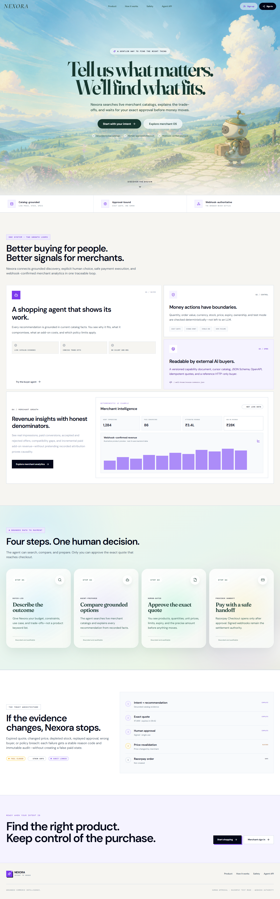
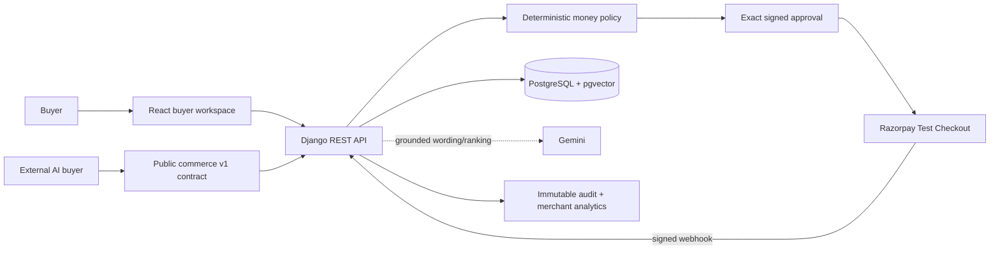
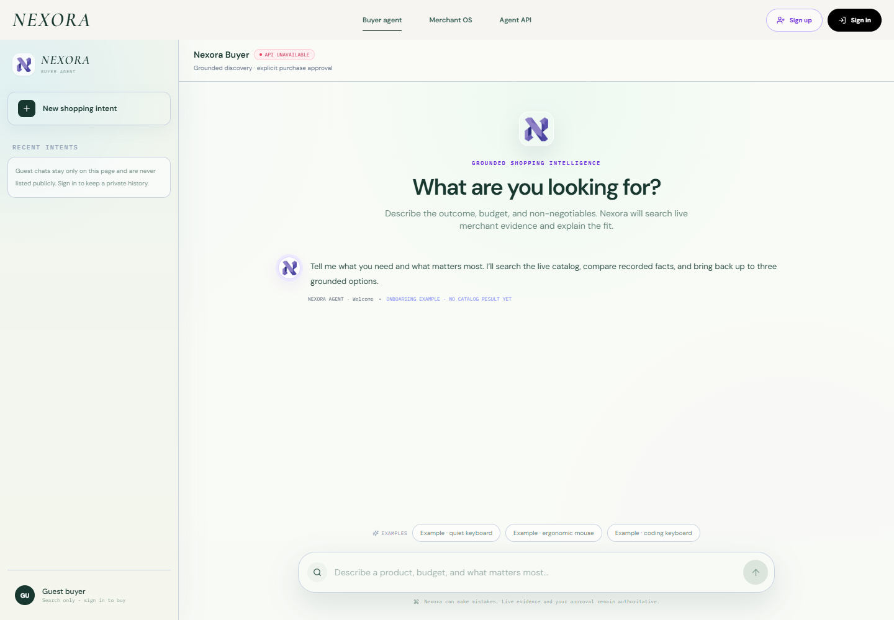
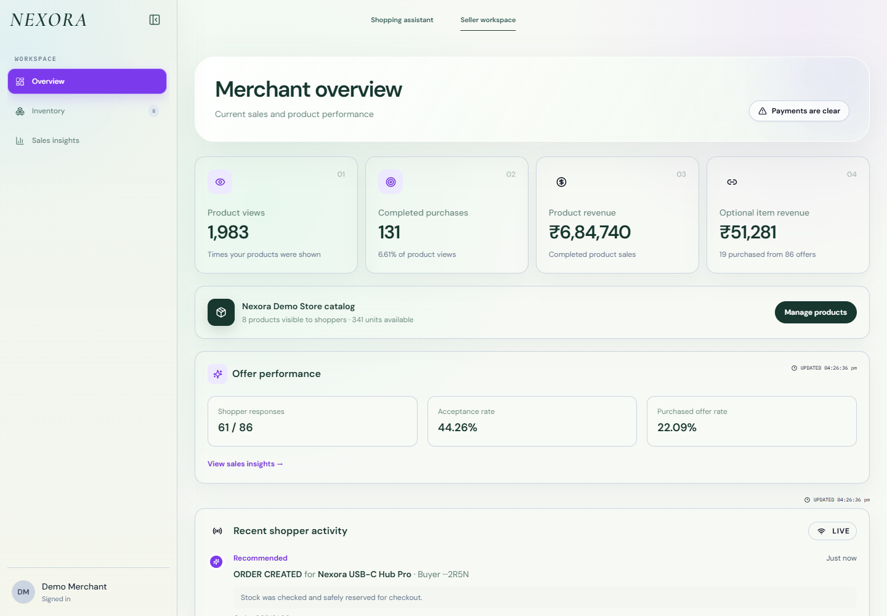
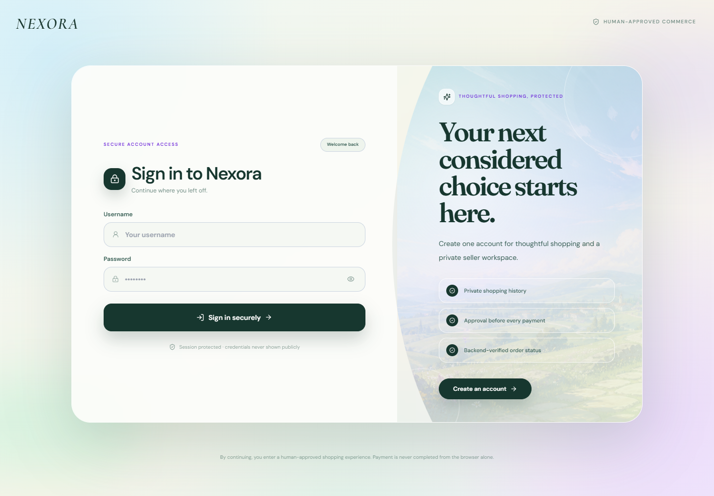
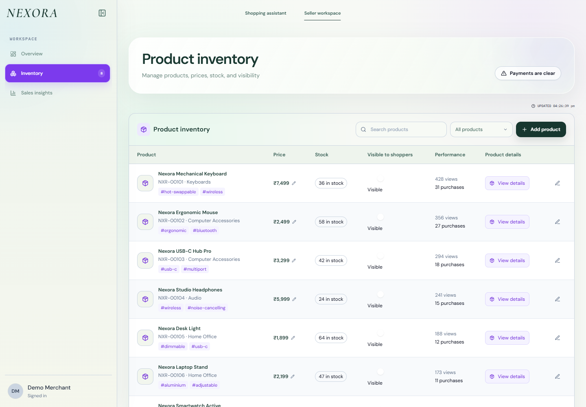
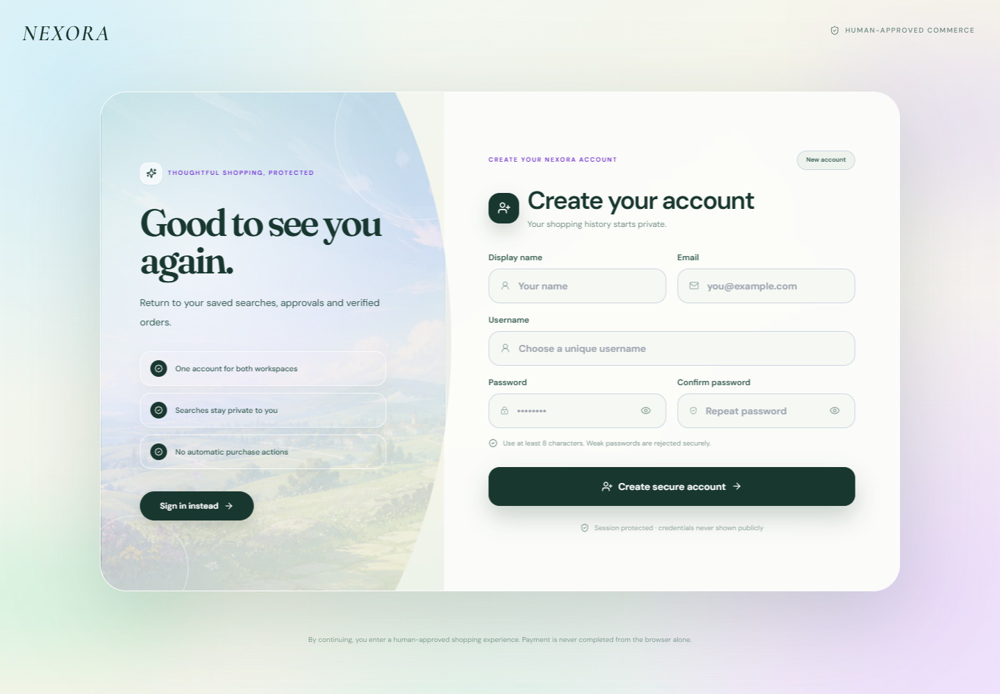
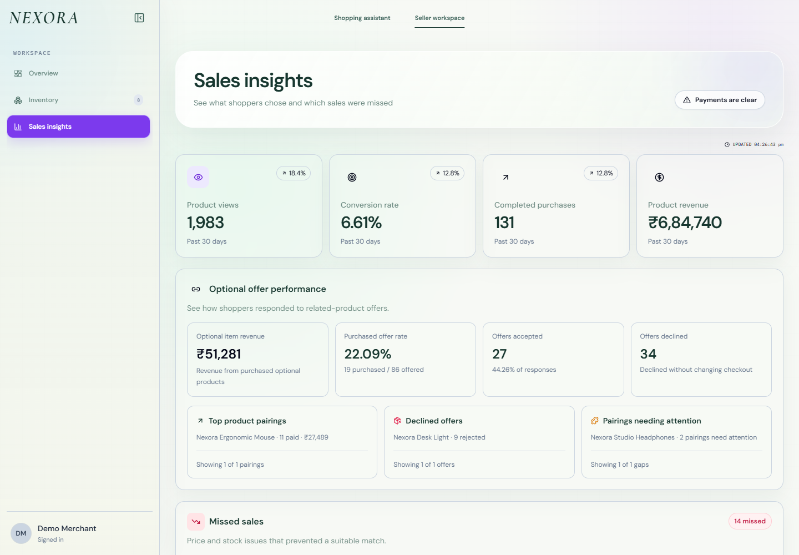
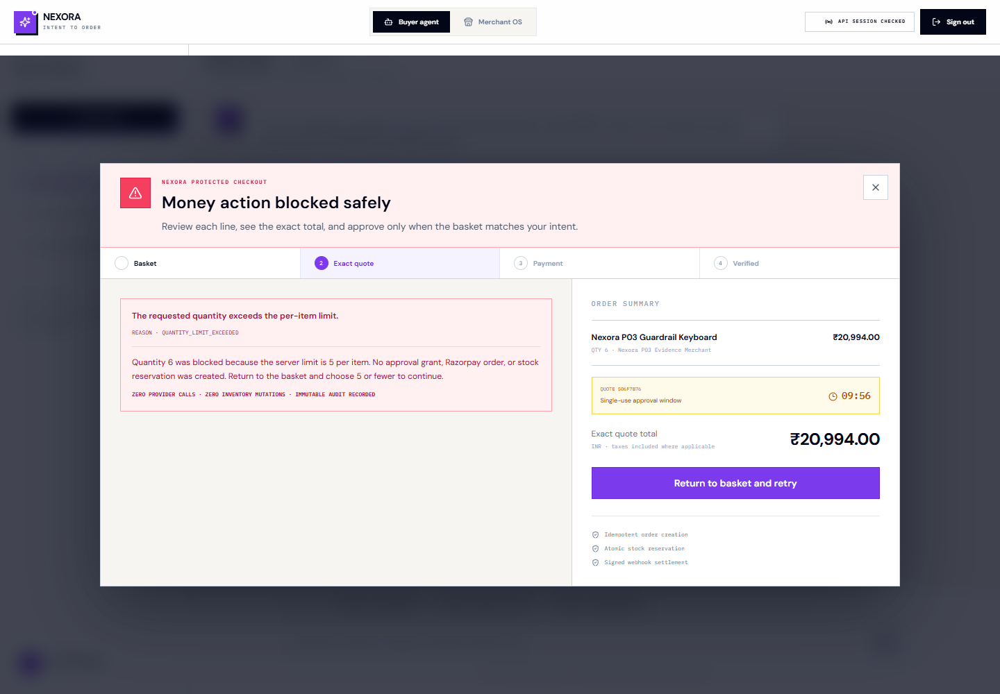
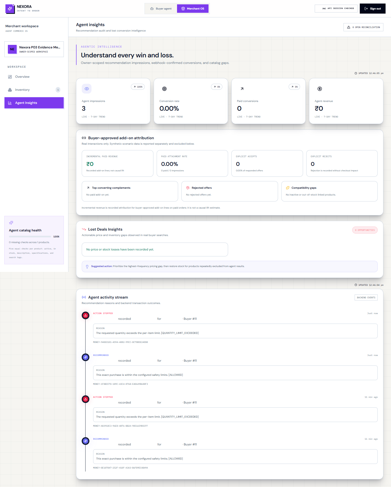

# Nexora — intent to order, with the human in control

Nexora is a Track 01 agentic-commerce system that turns a buyer's natural-language intent into a
grounded product recommendation, an optional buyer-approved add-on, an exact bounded quote, and a
Razorpay Test Mode checkout. It publishes both a native v1 contract and a pinned ACP `2026-04-17`
checkout-session compatibility profile so a separate AI buyer can discover and transact with a
Nexora merchant through public HTTP APIs.

> **Track thesis:** make merchants understandable and safely transactable by AI while creating
> relevant, explicitly accepted revenue opportunities. No LLM has payment authority.

[](https://github.com/SubhodeepRoy17/nexora/actions/workflows/ci.yml)



## Try the deployed build

| Surface | URL |
| --- | --- |
| Buyer and merchant application | [nexora-agentic-commerce.vercel.app](https://nexora-agentic-commerce.vercel.app/) |
| API readiness | [public readiness report](https://nexora-agentic-api.onrender.com/api/health/ready/) |
| External-agent discovery | [commerce capability document](https://nexora-agentic-api.onrender.com/.well-known/nexora-commerce.json) |
| Agent-commerce contract | [docs/AgentCommerceAPI.md](docs/AgentCommerceAPI.md) |

The public deployment is in Razorpay Test Mode. Real signed webhook settlement, delayed recovery,
and invalid-signature rejection are verified; the remaining Dashboard redelivery and other
deployment boundaries are recorded in
[docs/Phase7Evidence.md](docs/Phase7Evidence.md). Do not enter real payment credentials.

## Who it serves and why it is different

- **Buyers** describe outcomes and constraints instead of manually searching every storefront.
- **Merchants** publish an AI-readable catalog, compatible offers, live availability, and honest
  attributed outcomes through an owner-scoped workspace.
- **External AI buyers** receive a stable discovery and transaction contract without private model
  or database access.

Nexora separates probabilistic assistance from deterministic authority. The model can help
understand and explain; catalog facts, offer eligibility, approval, stock, amount, payment state,
and audit ownership remain server-enforced and independently testable.

## What Nexora proves

The connected demonstration starts with:

```text
Find the Nexora Nomad 75 quiet travel keyboard under ₹9000
```

Nexora returns grounded live-catalog options, offers one compatible ₹999 travel case, and waits for
an explicit accept or reject. Accepting creates a fresh two-line quote for exactly ₹8,498. The buyer
must approve that exact expiring quote before Nexora reserves stock and creates a Razorpay test
order. A browser callback is never enough to claim payment; a signed webhook or exact server-to-
server reconciliation provides settlement authority.

The verified Track proof includes:

- one captured Razorpay Test Mode order for ₹8,498;
- one explicitly accepted ₹999 add-on attributed exactly once to the paid order;
- two stock reservations consumed exactly once, without a second capture-time deduction;
- one deterministic `QUANTITY_LIMIT_EXCEEDED` path that creates no approval, reservation, provider
  order, or stock mutation; and
- one HTTP-only reference AI buyer that reaches the same human-approved checkout boundary using
  only the published contract.

Recorded add-on revenue remains attribution. A separate randomized eligible-session holdout now
measures revenue lift and refuses a directional conclusion until its sample and uncertainty gates pass.

## Architecture at a glance



The trust boundary is deliberate:

1. Gemini can parse, rank, and word grounded catalog results; it cannot mutate inventory or money
   state.
2. Deterministic server code enforces currency, quantity, value, ownership, product state, stock,
   price, expiry, idempotency, and Razorpay test mode.
3. Approval is short-lived, buyer-bound, quote-bound, signed, and single-use.
4. Inventory is reserved atomically before provider order creation and consumed or released once.
5. Only a verified webhook or exact provider reconciliation can produce backend-authoritative paid
   state.

See [docs/ArchitectureDiagrams.md](docs/ArchitectureDiagrams.md) for the system, successful-payment,
graceful-failure, and order-lifecycle diagrams.

## Product surfaces

| Buyer agent | Merchant OS |
| --- | --- |
|  |  |

| Secure access | Product inventory |
| --- | --- |
|  |  |

| Account creation | Sales insights |
| --- | --- |
|  |  |

| Safe failure | Merchant audit evidence |
| --- | --- |
|  |  |

## Evidence, not assertions

| Evidence | What it establishes |
| --- | --- |
| [Paid growth transaction](docs/Phase2Evidence.md) | Real Razorpay Test Mode capture, exact ₹8,498 order, accepted ₹999 add-on, strict reconciliation, and exactly-once inventory/revenue outcomes |
| [Graceful failure](docs/Phase3Evidence.md) | Stable reason code, zero provider/inventory effects, private immutable audit, and valid recovery |
| [Critical browser E2E](docs/Phase4Evidence.md) | Playwright journey through identity, search, offer choice, quote, approval, duplicate retry, refresh/resume, settlement, and merchant analytics |
| [Clean CI gate](docs/Phase5Evidence.md) | Locked installs, PostgreSQL/pgvector, migrations, backend/frontend/E2E tests, build, dependency audits, and secret scanning |
| [Recommendation evaluation](docs/Evaluation.md) | 56 rollback-only intents with constraint, grounding, relevance, refusal, prompt-injection, and forced-fallback measurements |
| [Public deployment](docs/Phase7Evidence.md) | Stable HTTPS surfaces, readiness/configuration evidence, and an honest list of pending operational acceptance items |
| [Submission package](docs/Phase8Evidence.md) | Official-source audit, evaluator entry points, hygiene pass, and explicit external gates |

The reproducible evaluation reports 100% constraint satisfaction, catalog groundedness, top-3
labelled relevance, correct no-result behavior, compatible add-on/refusal behavior, and forced-
provider-failure fallback success across the bounded synthetic set. Unsupported structured-claim
rate is 0%. These are test-set measurements, not population-wide or live-Gemini latency claims.

## External AI buyer contract

An independent client begins at `/.well-known/nexora-commerce.json`, follows the advertised catalog,
schema, OpenAPI, policy, quote, approval, checkout, and status links, and imports no Django models or
private services. Public catalog responses omit inactive inventory, buyers, secrets, embeddings,
and merchant-private analytics.

```bash
cd backend
export NEXORA_BUYER_USERNAME='demo-buyer'
export NEXORA_BUYER_PASSWORD='set-this-outside-source'
python -m examples.reference_ai_buyer \
  --base-url http://127.0.0.1:8000 \
  --query 'USB-C keyboard'
```

Nexora implements an ACP `2026-04-17` checkout-session compatibility profile with its human-present
Razorpay Test handler. It does **not** claim third-party certification, AP2 mandates, x402 settlement,
or conformance to an unpublished NPCI UAP schema. See
[docs/ACPCompatibility.md](docs/ACPCompatibility.md).

## Stack

- React 18, Vite, Tailwind CSS, Axios, and Playwright
- Django, Django REST Framework, Pydantic, and the Google Gen AI SDK
- PostgreSQL with pgvector/HNSW
- Razorpay Test Mode through a narrow HTTP adapter with constant-time signature verification
- Vercel, Render, and Neon

## Run locally

Prerequisites: Python 3.12, Node 22, PostgreSQL, and pgvector. Copy the examples and keep all real
credentials outside Git:

```bash
cp backend/.env.example backend/.env
cp frontend/.env.example frontend/.env
```

Backend:

```bash
python3 -m venv backend/.venv
source backend/.venv/bin/activate
python -m pip install --require-hashes -r backend/requirements.lock
cd backend
python manage.py migrate
python manage.py setup_pgvector
python manage.py seed_track_demo
python manage.py runserver
```

Set the `DEMO_*` identity values in `backend/.env` before seeding; credentials are never embedded or
printed. In another terminal:

```bash
cd frontend
npm ci
npm run dev
```

Open `http://localhost:5173`. For detailed database, authentication, catalog, payment, and deployment
setup, use [backend/README.md](backend/README.md), [frontend/README.md](frontend/README.md), and
[docs/DeploymentRunbook.md](docs/DeploymentRunbook.md).

## Verification

```bash
cd backend
python manage.py check
python manage.py makemigrations --check --dry-run
python manage.py test

cd ../frontend
npm test
npm run build
npm run test:e2e
```

CI additionally installs hash-locked Python dependencies, provisions PostgreSQL/pgvector, runs the
versioned evaluation, audits both dependency graphs, and scans Git history for secrets.

## Five-minute evaluation path

Use [docs/Pitch.md](docs/Pitch.md) for the timed narration, exact clicks, graceful-failure pivot, and
provider-outage fallback. [docs/Submission.md](docs/Submission.md) contains copy-ready official-form
answers and the final permissions/deployment/video checklist.

## Current limitations

- A redacted Razorpay Dashboard delivery-row capture and account-owner redelivery of that exact
  successful event remain required before webhook operational acceptance is complete. Real signed
  delivery, delayed reconciliation, and invalid-signature no-mutation behavior are verified.
- The checked-in same-origin Vercel `/api/*` proxy is not active in the currently deployed frontend;
  direct cross-site session cookies can be blocked by browser policy.
- Evaluation uses a bounded synthetic catalogue and deterministic provider-shaped responses; it
  does not measure public-network Gemini quality. The randomized growth experiment still needs
  meaningful real traffic before it can report a scoped causal estimate.
- The repository must be made publicly readable and the final five-minute video must be uploaded
  before submitting the official form.

## Roadmap to submission

Repository-controlled implementation and packaging are complete. The remaining gates are
operational: deploy the same-origin proxy, establish both scheduler heartbeats, capture the
Razorpay Test Dashboard delivery row and exact manual redelivery evidence, make the repository public, record
the five-minute video, and perform the final signed-out form/link audit. Track deployment acceptance
in [docs/Phase7Evidence.md](docs/Phase7Evidence.md) and final submission readiness in
[docs/Submission.md](docs/Submission.md). The ACP adapter and causal-lift experiment infrastructure
are repository-complete; production must still collect the real experiment sample, and external
certification cannot be self-issued.

## License

Nexora is available under the [MIT License](LICENSE). Seeded catalog records retain their individual
source and license metadata as documented in [docs/CatalogData.md](docs/CatalogData.md).
