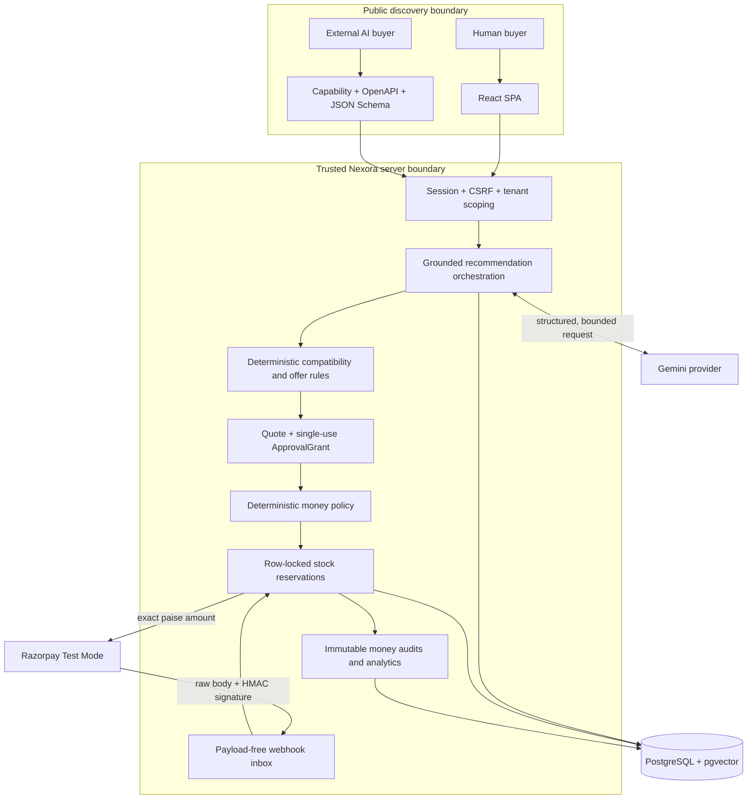
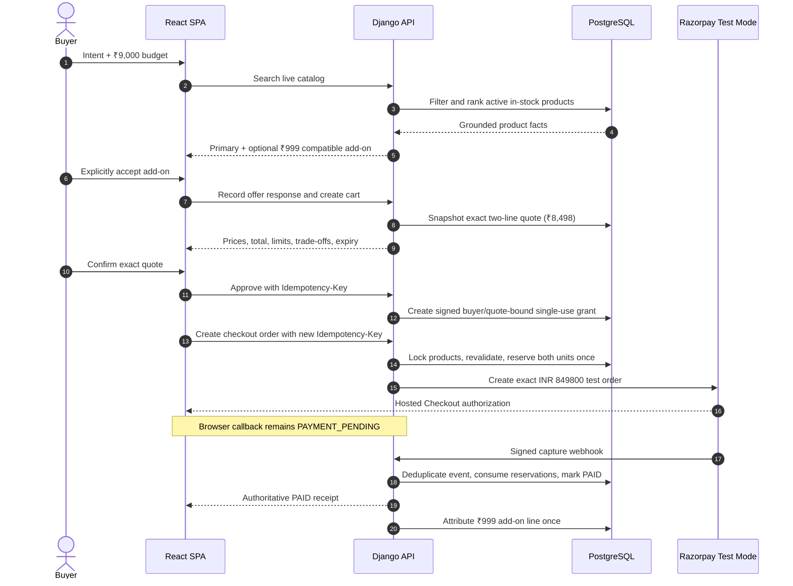
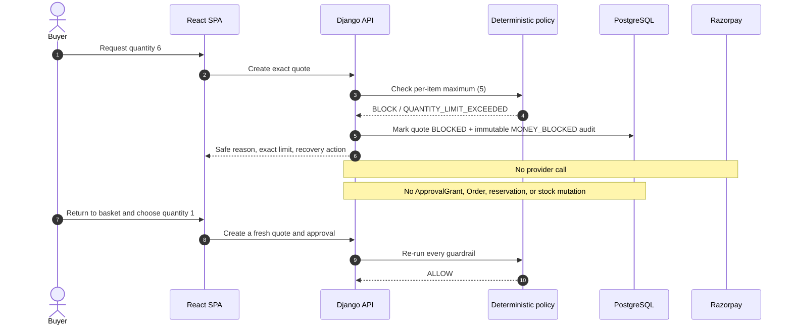
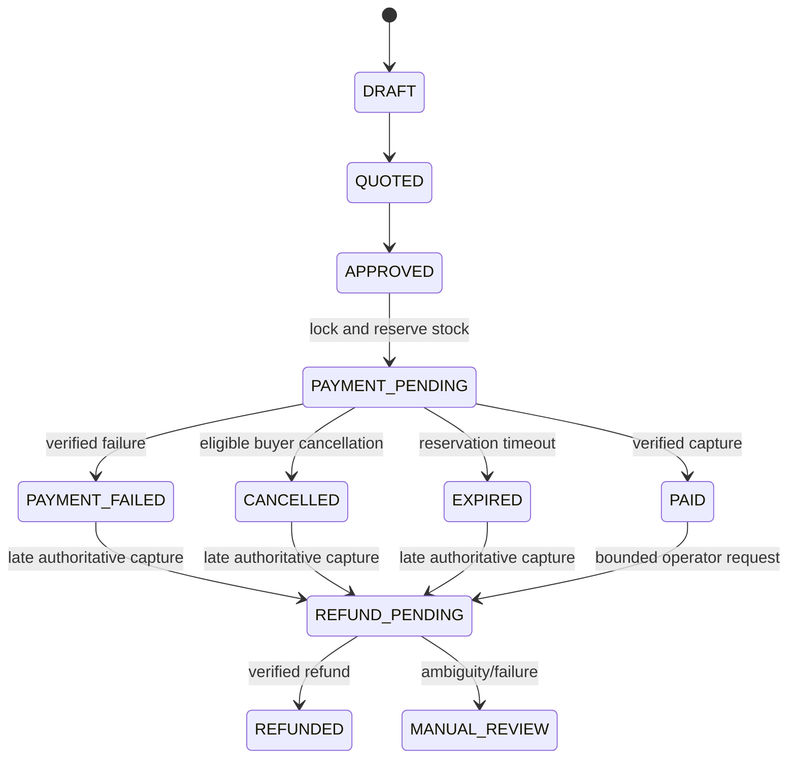

# Nexora Architecture Diagrams

These diagrams are evaluator-facing views of the implemented trust boundaries. Detailed endpoint,
model, and state invariants remain in `docs/Architecture.md` and `docs/API.md`.

## 1. System and authority boundaries

The LLM boundary is advisory. Product facts are overwritten from the database, growth eligibility
is deterministic, and no model response can approve a quote, reserve stock, create a provider order,
or settle payment.

## 2. Successful recommendation-to-payment sequence

Strict provider reconciliation can use the same locked capture service when a webhook is delayed. It
repairs only one exact captured payment matching provider order, amount, and currency; ambiguity goes
to manual review.

## 3. Deliberate graceful failure

## 4. Order and inventory lifecycle

An `ACTIVE -> CONSUMED` reservation never changes stock again. `ACTIVE -> RELEASED/EXPIRED` restores
stock once. Illegal backward transitions are rejected.
